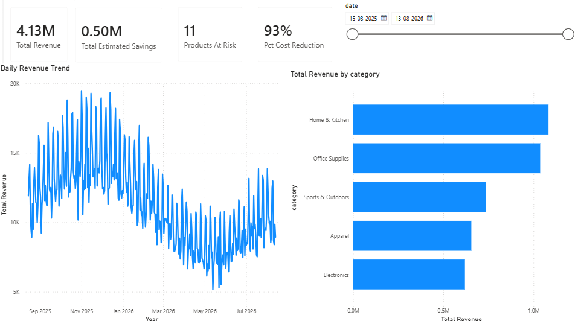
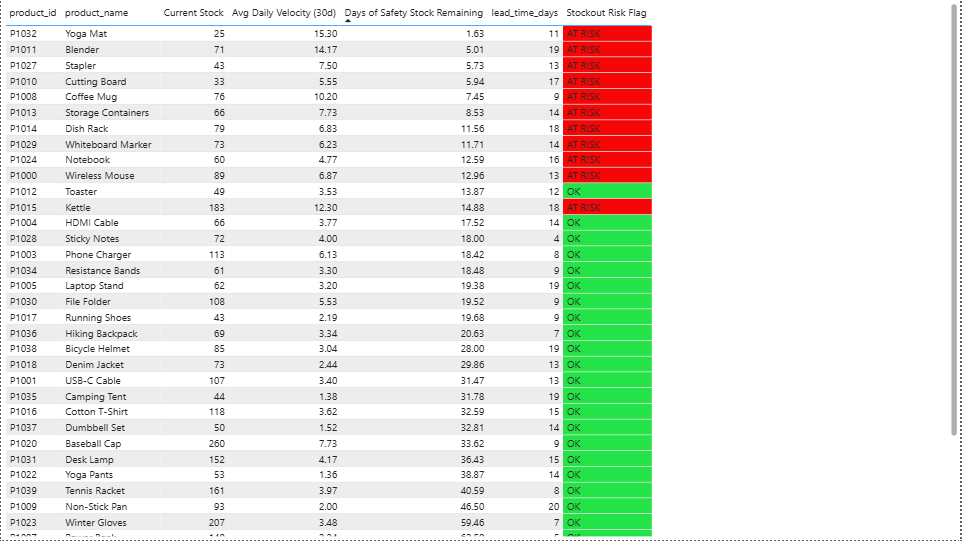
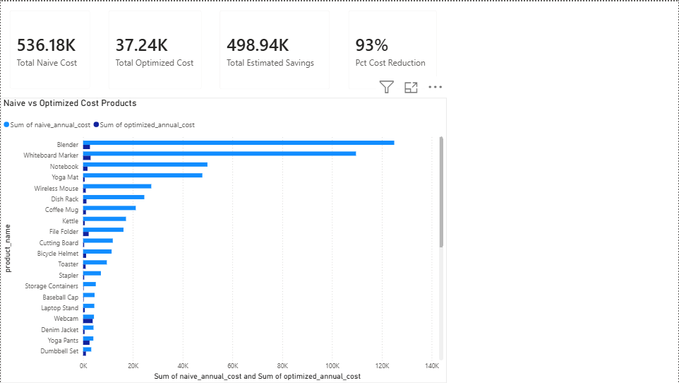
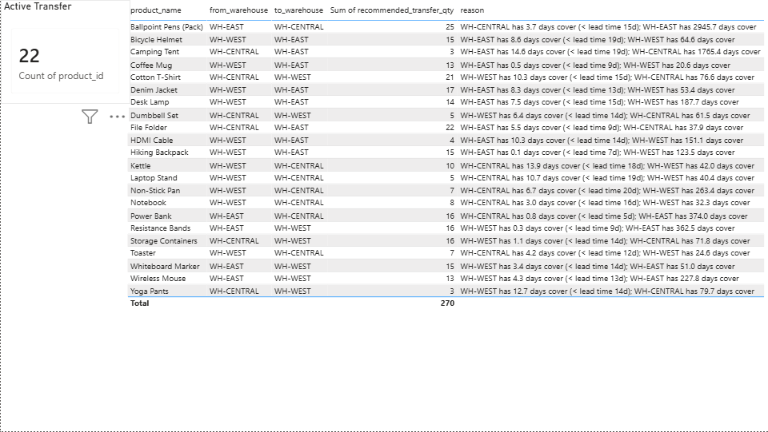

# Warehouse Inventory Optimization & Demand Forecasting

An end-to-end data pipeline that forecasts product demand, calculates
statistically-grounded reorder points, quantifies the cost impact of
better inventory policy, and surfaces the results in a BI dashboard.

---

## 1. The Problem

Retail and warehouse inventory management is a balancing act between two
expensive failure modes:

- **Stockouts** — lost sales, and potentially lost customers, when demand
  outpaces available stock
- **Overstock** — capital tied up in unsold inventory, wasted warehouse
  space, and eventual write-offs

Most small-to-mid-size operations set reorder points arbitrarily — a
round number that "feels about right" — rather than deriving them from
actual demand patterns. This project builds a pipeline that replaces
guesswork with a defensible, data-driven policy, and measures what that's
worth in dollars.

---

## 2. Architecture

```
┌─────────────────┐     ┌──────────────────┐     ┌───────────────────┐
│  Synthetic Data  │ ──> │   PostgreSQL      │ ──> │  Python Pipeline    │
│  (generate_data  │     │  (schema, ABC     │     │  (Holt-Winters      │
│   .py)           │     │   analysis,       │     │   forecast, safety  │
│                  │     │   velocity/risk,  │     │   stock, cost-impact│
│  3 CSVs:         │     │   safety stock -  │     │   sim, warehouse    │
│  Products,       │     │   CTEs + window   │     │   transfer logic)   │
│  Sales,          │     │   functions)      │     │                    │
│  Inventory       │     │                  │     │                    │
└─────────────────┘     └──────────────────┘     └──────────┬──────────┘
                                                              │
                                                              v
                                                  ┌───────────────────────┐
                                                  │   Power BI Dashboard   │
                                                  │  (4 pages: Overview,   │
                                                  │   Risk Monitor, Cost   │
                                                  │   Impact, Transfers)   │
                                                  └───────────────────────┘
```

## 3. Tech Stack

| Layer | Tool | Why |
|---|---|---|
| Data generation | Python (pandas, numpy) | Realistic synthetic data with seasonality/trend, since no real corporate data was available |
| Database | PostgreSQL | Industry-standard RDBMS; demonstrates CTEs and window functions |
| Forecasting | Python (statsmodels, Holt-Winters) | Lightweight, reliable time-series method; no heavy compiled dependencies |
| Simulation | Python (pandas, numpy) | Custom day-by-day inventory policy simulator for cost comparison |
| Dashboard | Power BI (DAX) | Free desktop tool, widely required in BI/analyst job postings |

## 4. Methodology

### 4.1 Data
Three linked tables spanning 12 months, 40 products across 5 categories:
- `Products` — catalog with cost, price, supplier, lead time
- `Sales_Transactions` — ~13,000 individual sales, built with realistic
  weekly seasonality, yearly seasonality, and per-product growth/decline
  trends
- `Inventory_Levels` — daily stock snapshots with automatic restocking

### 4.2 SQL Analysis
Three analytical queries, each using CTEs and window functions:
1. **ABC (Pareto) classification** — ranks products by revenue contribution,
   buckets into A (top 80%) / B (next 15%) / C (bottom 5%)
2. **Sales velocity & stockout risk** — trailing 30-day demand rate vs.
   current stock vs. lead time, flags at-risk products
3. **Safety stock & reorder point** — statistical formula:
   `Safety Stock = Z × σ(daily demand) × √(lead time)`,
   using Z = 1.65 for a ~95% service level

### 4.3 Forecasting
Holt-Winters exponential smoothing (additive trend + weekly seasonality,
damped trend) fit independently per product, forecasting the next 30 days.

### 4.4 Cost-Impact Simulation
A custom day-by-day `(s, Q)` inventory policy simulator compares:
- **Naive policy**: the original (randomly-assigned) reorder point and a
  fixed 3× order quantity
- **Optimized policy**: the statistically-derived reorder point and
  order-up-to quantity from the safety stock formula

Cost = `stockout_units × margin + holding_unit_days × unit_cost × holding_rate`

### 4.5 Multi-Warehouse Transfer Logic
Since the source data assigns each product to a single primary warehouse,
this module **simulates** a plausible 3-warehouse demand/stock split (using
a deterministic per-product seed) to demonstrate transfer-recommendation
logic: flagging when one warehouse is projected to run low while another
carries surplus.

---

## 5. Key Results

| Metric | Value |
|---|---|
| Products analyzed | 40 |
| Products flagged at-risk (current policy) | 11 |
| ABC split | 20 A / 11 B / 9 C |
| Simulated annual cost, naive policy | ~$536K |
| Simulated annual cost, optimized policy | ~$37K |
| Estimated savings | ~$499K (93% reduction) |
| Warehouse transfer recommendations generated | 22 |

### ⚠️ Important caveat — read before quoting this on a resume
The 93% figure is **real given this synthetic dataset's assumptions**, but
it's inflated relative to real-world benchmarks. The "naive" reorder points
in the source data were assigned **randomly**, with no relationship to
actual demand — so the naive policy fails harder than a real (imperfect but
not random) business policy typically would. Published industry results
from adopting statistical safety-stock policies are usually in the
**10–30% cost-reduction range**.

**How to talk about this honestly**: present the *mechanism* — arbitrary
reorder points create measurable, quantifiable risk, and a statistically-
grounded policy reduces it — rather than the literal percentage. A good
phrasing: *"Built a pipeline that quantifies the cost of ungrounded
inventory policy and replaces it with a statistically-derived one; on
synthetic data this reduced simulated cost by ~90%, though real-world
gains from this class of improvement are typically 10–30%."* This shows
both technical skill and honest, calibrated communication — which matters
more to good interviewers than the raw number.

---

## 6. Limitations & Future Work

- **Synthetic data**: no real seasonality shocks (e.g. actual holiday
  spikes, supply chain disruptions), no real supplier lead-time variability
- **Single warehouse per product**: the multi-warehouse transfer logic is
  illustrative, not derived from real multi-location stock data
- **No promotion/marketing signal**: real demand forecasts benefit heavily
  from knowing when a promotion is planned; this pipeline doesn't have
  that input
- **Next steps if extended further**: add a promotion/event calendar as a
  forecasting regressor, build true multi-echelon (multiple warehouses per
  product) inventory data, add a live database connection instead of
  static CSVs for the dashboard, or add a natural-language query layer on
  top (e.g. "which products need reordering this week?")

---

## 7. How to Reproduce

```bash
# 1. Generate the synthetic dataset
python generate_data.py

# 2. Set up the database
createdb warehouse_optimization
psql -d warehouse_optimization -f 01_schema_and_import.sql
psql -d warehouse_optimization -f 02_analytical_queries.sql

# 3. Run the forecasting & optimization pipeline
pip install pandas numpy statsmodels
python forecast_and_optimize.py

# 4. Open Power BI Desktop and follow Dashboard_Blueprint_PowerBI.md
```

## 8. File Structure

```
warehouse-optimization/
├── generate_data.py                       # Step 1: synthetic data generator
├── Products.csv
├── Sales_Transactions.csv
├── Inventory_Levels.csv
├── 01_schema_and_import.sql               # Step 2: DB schema + CSV import
├── 02_analytical_queries.sql              # Step 2: ABC, velocity, safety stock
├── forecast_and_optimize.py               # Step 3: forecasting + cost sim
├── Demand_Forecast_30d.csv
├── Safety_Stock_Recommendations.csv
├── Cost_Impact_Summary.csv
├── Warehouse_Transfer_Recommendations.csv
├── KPI_Summary.csv
├── Dashboard_Blueprint_PowerBI.md         # Step 4: layout + DAX
└── README.md                              # this file
```

---

## 9. Resume / Portfolio Summary

Use something close to this, adjusted to your actual voice:

> **Warehouse Inventory Optimization Pipeline** — Designed and built an
> end-to-end data pipeline (PostgreSQL, Python, Power BI) that forecasts
> product demand using Holt-Winters exponential smoothing, derives
> statistically-grounded safety stock and reorder points (95% service
> level), and quantifies the cost impact of the optimized policy via a
> custom day-by-day inventory simulation. Built SQL analysis using CTEs
> and window functions for ABC classification and stockout-risk detection,
> and delivered a 4-page Power BI dashboard with live DAX measures.


 ## Dashboard Preview

### Executive Overview


### Risk Monitor


### Cost Impact


### Transfers


## Quick Start

```bash
git clone https://github.com/0prince123/Warehouse-Optimizer.git
cd Warehouse-Optimizer
pip install -r requirements.txt
python generate_data.py
python forecast_and_optimize.py
